# Lolday Architecture

> Target audience: engineers / AI sessions new to lolday. After reading this document you should be able to describe what each component does, how data flows, what external services we depend on, where env vars live, and which traps to avoid.
>
> Sources: original platform spec at `docs/superpowers/specs/2026-03-30-lolday-platform-design.md` plus the per-phase specs under `docs/superpowers/specs/`. This file is a navigational summary, not a substitute for them.

## 1. Purpose & positioning

Lolday is **ISLab's internal ML platform for managing the lifecycle of malware detectors**. A user defines a detector (Python code following the `maldet` spec), lolday builds it into an OCI image, runs training/evaluation/prediction jobs as Volcano `vcjob` workloads on GPUs, tracks experiments via MLflow, and stores models in MLflow's registry plus images in a private Harbor registry.

Lolday is **glue code, not a framework**. Detector logic lives in the external `maldet` PyPI package; lolday integrates against it. We write custom code only for the glue layer and `maldet`-spec-specific orchestration.

- **Deploy target**: server30 (`140.118.155.30`, SSH 9453), Ubuntu 24.04, K3s single-node, NVIDIA GPU operator on host. Shared lab server.
- **Non-goals**: multi-tenant SaaS, multi-cluster, cloud-managed deployment, public exposure beyond Cloudflare Access SSO.

## 2. System diagram

```mermaid
C4Container
  title Lolday — Container view (server30)

  Person(user, "Researcher", "ISLab member, browser via Cloudflare Access SSO")

  System_Boundary(cf, "Cloudflare") {
    Container(cfaccess, "Cloudflare Access", "SSO", "JWT in CF-Access-Jwt-Assertion")
    Container(cftunnel, "Cloudflare Tunnel", "cloudflared")
  }

  System_Boundary(k3s, "K3s on server30") {
    Container(traefik, "Traefik", "K3s built-in", "Ingress")
    Container(frontend, "frontend", "Vite + React + nginx-unprivileged", "SPA, served at 8080")
    Container(backend, "backend", "FastAPI + uv", "REST API + reconciler loop")
    ContainerDb(pg, "PostgreSQL", "bitnami sub-chart", "Primary DB")
    ContainerDb(redis, "Redis", "bitnami sub-chart", "Rate limit, event-tail buffer")
    Container(mlflow, "MLflow", "custom image", "Tracking + Model Registry")
    Container(harbor, "Harbor", "sub-chart", "OCI image registry")
    Container(volcano, "Volcano", "sub-chart", "GPU batch queue (vcjob)")
    Container(vcjob, "vcjob (job-helper)", "Python on pytorch-cu12-base", "Detector entrypoint")
    Container(loki, "Loki", "sub-chart", "Log aggregation")
    Container(alloy, "Alloy", "sub-chart", "Log/metric collector")
    Container(prom, "Prometheus", "kps sub-chart", "Metrics")
    Container(grafana, "Grafana", "kps sub-chart", "Dashboards")
    Container(am, "Alertmanager", "kps sub-chart", "Alert routing")
    Container(trivy, "Trivy operator", "sub-chart", "Image vuln scan")
    Container(deadman, "deadmans-switch", "CronJob", "Health heartbeat")
  }

  System_Ext(discord_events, "Discord webhook (events)", "User notifications")
  System_Ext(discord_dms, "Discord webhook (deadmans-switch)", "Health heartbeat sink")
  System_Ext(maldet, "maldet PyPI", "Detector framework")
  System_Ext(github, "GitHub", "Git repo (no Actions)")

  Rel(user, cftunnel, "HTTPS")
  Rel(cftunnel, cfaccess, "verifies via")
  Rel(cftunnel, traefik, "tunneled")
  Rel(traefik, frontend, "/", "HTTP")
  Rel(traefik, backend, "/api/v1/*", "HTTP")
  Rel(backend, pg, "asyncpg")
  Rel(backend, redis, "redis-py")
  Rel(backend, mlflow, "mlflow-skinny + httpx")
  Rel(backend, harbor, "REST")
  Rel(backend, volcano, "kubernetes API → create vcjob")
  Rel(backend, discord_events, "httpx (fire-and-forget)")
  Rel(volcano, vcjob, "schedules")
  Rel(vcjob, harbor, "pull detector image")
  Rel(vcjob, mlflow, "log run")
  Rel(vcjob, backend, "POST /internal/jobs/{id}/events")
  Rel(alloy, loki, "logs")
  Rel(prom, backend, "scrapes /metrics via ServiceMonitor")
  Rel(grafana, prom, "queries")
  Rel(grafana, loki, "queries")
  Rel(am, discord_events, "alert routing")
  Rel(deadman, discord_dms, "heartbeat")
  Rel(trivy, harbor, "scan reports")
  Rel(backend, maldet, "import (built into image)")
```



## 3. Component responsibility table

### Platform

| 元件                  | 技術                                          | 進入點                                       | 主要責任                                                          | 對應 rules / specs                      |
| --------------------- | --------------------------------------------- | -------------------------------------------- | ----------------------------------------------------------------- | --------------------------------------- |
| backend               | FastAPI 0.115 + Py3.12 + uv                   | `backend/app/main.py`                        | REST API + reconciler loop                                        | `.claude/rules/backend.md`              |
| frontend              | Vite + React 18 + TS 5.5 + nginx-unprivileged | `frontend/src/main.tsx`                      | SPA UI; pulls API via TanStack Query                              | `.claude/rules/frontend.md`             |
| reconciler            | in-process within backend                     | `backend/app/reconciler/` (9-module pkg)     | Watch vcjob events; sync DB; tail event manifests; orphan cleanup | phase11b/12 specs; PR #53 split plan    |
| Volcano queue         | volcano `~1.14.1` sub-chart                   | `charts/lolday/templates/volcano-queue.yaml` | GPU batch scheduling                                              | `.claude/rules/charts-and-helm.md`      |
| Harbor                | harbor `1.18.3` sub-chart                     | `charts/lolday/charts/harbor-1.18.3.tgz`     | OCI registry for detector images                                  | `scripts/recover-harbor.sh`             |
| MLflow                | mlflow-skinny 2.20 + custom server image      | `charts/lolday/helpers/mlflow-server/`       | Experiment tracking + model registry                              | `backend/app/services/mlflow_client.py` |
| PostgreSQL            | bitnami sub-chart                             | `charts/lolday/templates/postgresql.yaml`    | Primary DB                                                        | `backend/migrations/`                   |
| Redis                 | bitnami sub-chart                             | `charts/lolday/templates/redis.yaml`         | Rate limit, event-tail buffer                                     | `backend/app/services/rate_limit.py`    |
| Cloudflared           | (no sub-chart)                                | `charts/lolday/templates/cloudflared.yaml`   | SSO tunnel                                                        | `backend/app/auth/cf_access.py`         |
| kube-prometheus-stack | kps `~84.3.0`                                 | (sub-chart)                                  | Prom + Grafana + Alertmanager                                     | `charts/lolday/templates/monitoring/`   |
| Loki + Alloy          | `~7.0.0` + `~1.8.0`                           | (sub-charts)                                 | Log aggregation + collector                                       | —                                       |
| Trivy operator        | `~0.32.1`                                     | (sub-chart)                                  | Image vuln scan                                                   | —                                       |
| GPU operator          | upstream NVIDIA chart (NOT in this repo)      | installed via README setup                   | NVIDIA driver + DCGM exporter                                     | `README.md`                             |

### Helpers (`charts/lolday/helpers/`)

| Helper            | Tech                                      | What it does                                                                                              |
| ----------------- | ----------------------------------------- | --------------------------------------------------------------------------------------------------------- |
| build-helper      | Python (own `pyproject.toml` + `uv.lock`) | Validates a built detector matches the maldet spec via `maldet_validator.py`. Used by the build pipeline. |
| job-helper        | Python module + tests                     | vcjob entrypoint. Fetches detector code, calls `maldet`, logs to MLflow, posts events to backend.         |
| mlflow-server     | Dockerfile only                           | Custom mlflow tracking server image.                                                                      |
| pytorch-cu12-base | Dockerfile only                           | GPU base image (CUDA 12 + PyTorch).                                                                       |

### Monitoring (`charts/lolday/templates/monitoring/`)

| Resource                                                                | Purpose                                                                                  |
| ----------------------------------------------------------------------- | ---------------------------------------------------------------------------------------- |
| `alertmanager-rules.yaml` + `alertmanager-config-discord.yaml`          | Prom rules + Discord receiver                                                            |
| `deadmans-switch.yaml` + `charts/lolday/files/deadmans_switch/check.py` | CronJob heartbeat to an independent Discord webhook (fail-fast on missing `DISCORD_URL`) |
| `grafana-admin-secret.yaml` + `grafana-dashboards.yaml`                 | Grafana wiring + dashboards                                                              |
| `postgres-exporter-initjob.yaml` + `postgres-exporter.yaml`             | Postgres metrics exporter                                                                |
| `servicemonitor-{backend,dcgm,postgres,traefik,trivy,volcano}.yaml`     | ServiceMonitors × 6                                                                      |

### Notifications

| Channel                | Code path                                                                                 | Pattern                                                                                                           |
| ---------------------- | ----------------------------------------------------------------------------------------- | ----------------------------------------------------------------------------------------------------------------- |
| Discord events webhook | `backend/app/services/discord.py` (embed builders) + `services/notify.py` (HTTP delivery) | Fire-and-forget; `asyncio.create_task(notify_*(...))`; errors counted to `BACKEND_ERRORS{stage="discord_notify"}` |
| Deadmans-switch        | `charts/lolday/files/deadmans_switch/check.py`                                            | Independent webhook (`DISCORD_URL` env); fail-fast on missing                                                     |

## 4. Data flows

### 4.1 Build a detector

`User` → `frontend POST /detectors` → `backend` writes Detector row → `backend` triggers a build via the `build-helper` image (BuildKit) + `services/build.py` → image pushed to Harbor → DB row marked ready → notification dispatched to Discord events.

### 4.2 Run a job (core flow)

`User` → `frontend POST /jobs` → `backend` writes Job row + creates a Volcano `vcjob` via the kubernetes API (`services/k8s.py` + `services/job_spec.py`) → `vcjob` pulls the detector image from Harbor + the dataset PVC → `job-helper` runs `maldet` → writes an MLflow run → posts events to `POST /internal/jobs/{id}/events` (auth via one-time bearer token from `services/job_tokens.py`) → `reconciler.py` watches vcjob status and event-tail and syncs the DB → notification dispatched on completion or failure.

### 4.3 SSO / auth

Browser → Cloudflare tunnel → Cloudflare Access verifies the user → injects `CF-Access-Jwt-Assertion` header → request reaches backend → `backend/app/auth/cf_access.py` verifies the JWT against the Cloudflare JWKS (cached via `CF_ACCESS_JWKS_CACHE_TTL_SECONDS`) → `cf_access_user` get-or-creates a `User` row → `current_active_user` is the dependency for every protected route.

### 4.4 Monitoring & logs

- Backend exposes `/metrics` via `prometheus-fastapi-instrumentator`. `monitoring/servicemonitor-backend.yaml` registers it with Prom.
- Stdout from every pod is collected by Alloy and shipped to Loki.
- Grafana queries Prom + Loki. Dashboards mounted via `monitoring/grafana-dashboards.yaml` from `charts/lolday/dashboards/*.json`.
- Alertmanager receives Prom alerts and routes them to Discord via `alertmanager-config-discord.yaml`.

### 4.5 Notifications (fire-and-forget)

The caller (typically `reconciler.py` on job completion, or `services/build.py` on build completion) wraps `asyncio.create_task(notify_*(...))`. `services/notify.py` does the HTTP via httpx with a 5-second timeout; failures are swallowed and counted to the Prom counter `BACKEND_ERRORS{stage="discord_notify"}`. The caller never sees a failure.

To debug a missing notification, **check the Prom counter**, not the caller. Silence in code is by design.

Service-token-driven jobs skip notify (Phase 12) — machine principals don't ping themselves.

The `deadmans-switch` is a separate channel via its own webhook; missing config causes CrashLoopBackOff intentionally.

## 5. Env vars & config sources

`backend/app/config.py` (Pydantic Settings) is the single source of truth for runtime config. This section is a navigational summary; the file itself is the spec.

### 5.1 Runtime env vars (read by backend, set via Helm `values.yaml`)

Grouped:

- **Core** — `DATABASE_URL`, `REDIS_URL`, `DOCS_ENABLED`, `ENVIRONMENT` (`production` / `development`), `LOLDAY_UI_BASE_URL`
- **Crypto** — `FERNET_KEY` (base64 32-byte; encrypts secret columns)
- **Harbor** — `HARBOR_URL`, `HARBOR_ADMIN_USERNAME`, `HARBOR_ADMIN_PASSWORD`, `HARBOR_IMAGE_PREFIX`
- **Build** — `BUILD_NAMESPACE`, `BUILD_IMAGE_HELPER`, `BUILD_IMAGE_BUILDKIT`, `BUILD_IMAGE_GIT`, `BUILD_TIMEOUT_SECONDS`, `BUILD_CONCURRENCY_PER_USER`, `BUILD_LOG_TAIL_BYTES`, `REPO_MAX_SIZE_MB`
- **Backend self-URL** — `BACKEND_INTERNAL_URL`, `INTERNAL_EVENTS_BASE_URL`
- **Reconciler** — `RECONCILER_ENABLED`
- **Job** — `JOB_NAMESPACE`, `JOB_HELPER_IMAGE`, `JOB_ACTIVE_DEADLINE_TRAIN_SECONDS` (6h), `JOB_ACTIVE_DEADLINE_EVALUATE_SECONDS` (30m), `JOB_ACTIVE_DEADLINE_PREDICT_SECONDS` (1h), `JOB_TTL_SECONDS_AFTER_FINISHED` (7d), `JOB_NODE_SELECTOR_HOSTNAME`, `JOB_PER_USER_CONCURRENCY`, `JOB_IDEMPOTENCY_WINDOW_SECONDS`, `JOB_BACKEND_URL`
- **MLflow** — `MLFLOW_TRACKING_URI`, `MLFLOW_HTTP_TIMEOUT_SECONDS`, `MLFLOW_HTTP_RETRIES`
- **Dataset** — `DATASET_CSV_MAX_BYTES`, `DATASET_SPOT_CHECK_COUNT`, `DATASET_SPOT_CHECK_MISSING_THRESHOLD`, `SAMPLES_ROOT`, `SAMPLES_LOCAL_ROOT`
- **Discord** — `DISCORD_WEBHOOK_URL_EVENTS`, `DISCORD_HTTP_TIMEOUT_SECONDS`
- **Cloudflare Access SSO** — `CF_ACCESS_TEAM_DOMAIN`, `CF_ACCESS_APP_AUD`, `CF_ACCESS_JWKS_CACHE_TTL_SECONDS`, `AUTH_DEV_MODE` (forbidden in production), `AUTH_DEV_EMAIL`

### 5.2 Operator-local env files (repo root, gitignored)

| File                                 | Mode | Used by                                                                                                                                                                                                                                                                                                                                                                                                                                                                                                                                                                                                                                                        |
| ------------------------------------ | ---- | -------------------------------------------------------------------------------------------------------------------------------------------------------------------------------------------------------------------------------------------------------------------------------------------------------------------------------------------------------------------------------------------------------------------------------------------------------------------------------------------------------------------------------------------------------------------------------------------------------------------------------------------------------------- |
| `.lolday-secrets.env`                | 600  | `scripts/deploy.sh`, `recover-harbor.sh`, `harbor-inventory.sh`, `fix-lolday-project-public.sh`, `diag-backend-401.sh`, `phase6-pre-deploy-check.sh`. Required keys (see `.lolday-secrets.env.example` for the canonical list with comments): `GRAFANA_ADMIN_PASSWORD`, `PG_EXPORTER_PASSWORD`, `CF_ENABLED`, `CF_TUNNEL_TOKEN`, `DISCORD_WEBHOOK_URL_{EVENTS,WARNING,CRITICAL}`, `HARBOR_ADMIN_PASSWORD`, `PG_PASSWORD`, `MLFLOW_DB_PASSWORD`, `FERNET_KEY`, plus `CF_ACCESS_CLIENT_ID` / `CF_ACCESS_CLIENT_SECRET` (machine-principal service token; sourced manually for `/users/me` svctoken debug — see `docs/phase-history/phase12.1-role-enum-bug.md`). |
| `.lolday-cloudflare-access-backups/` | dir  | JSON snapshots of Cloudflare Access app/policy state (audit backups). Created ad-hoc, not consumed by any script.                                                                                                                                                                                                                                                                                                                                                                                                                                                                                                                                              |

Template: `.lolday-secrets.env.example` at repo root (committed).

### 5.3 Harbor DNS — two intentional forms

Two host names point at Harbor; they are **not interchangeable**:

| Name                                | Resolved by                                                                                                                                                                                   | Used for                                                      |
| ----------------------------------- | --------------------------------------------------------------------------------------------------------------------------------------------------------------------------------------------- | ------------------------------------------------------------- |
| `harbor.harbor.svc[.cluster.local]` | K8s in-cluster DNS (CoreDNS) — Harbor's Service in the `harbor` namespace                                                                                                                     | HTTP API calls from inside a pod (e.g. backend → Harbor REST) |
| `harbor.lolday.svc[.cluster.local]` | server30 host-level setup: `/etc/hosts` entry + K3s containerd registry mirror (`/etc/rancher/k3s/registries.yaml`, see `scripts/patch-k3s-registries.sh`) — both point at Harbor's ClusterIP | Image pulls (containerd at the kubelet / docker level)        |

**Defaults in `backend/app/config.py`** all use the K8s native form (`harbor.harbor.svc`) — appropriate for tests and as a sentinel.

**Production overrides in `charts/lolday/values.yaml`** uniformly use `harbor.lolday.svc` (because in production the values are consumed by templates that render image references AND by the backend pod making API calls; the host-level mirror handles both).

If you see a default in `config.py` that uses `harbor.lolday.svc`, it's likely a copy-paste error from values.yaml — flag it.

## 6. Build / Test / Release

### CI/CD overview

Six GitHub Actions workflows under `.github/workflows/` enforce hygiene + tests on every PR and publish container images to GHCR on `main` / tag pushes:

- `lint.yml` — `pre-commit run --all-files` (single source of truth).
- `backend.yml` — `cd backend && uv run pytest`.
- `frontend.yml` — `pnpm typecheck` + `pnpm test` (vitest). Playwright deferred (commented-out hook).
- `helm.yml` — `helm dependency update` + `helm lint` + `helm template`.
- `images.yml` — backend / frontend Dockerfile build → GHCR.
- `helpers.yml` — build-helper / job-helper Dockerfile build → GHCR (mlflow-server / pytorch-cu12-base out of scope).

CI is **verification + GHCR artefact only**. Production registry (`harbor.lolday.svc:80/lolday/*`) and `bash scripts/deploy.sh` remain operator-driven on server30. See `docs/conventions.md` §10 and `.claude/rules/github-actions.md`.

### Backend image — `backend/Dockerfile`

- Base: `python:3.12-slim`
- `uv` copied from `ghcr.io/astral-sh/uv:latest`
- `uv sync --frozen --no-dev --no-editable` (production lock-step)
- CMD: `uv run uvicorn app.main:app --host 0.0.0.0 --port 8000`

### Frontend image — `frontend/Dockerfile`

- Two-stage: `node:22-alpine` (build with corepack + pnpm) → `nginxinc/nginx-unprivileged:1.27-alpine` (serve)
- Non-root, listens on 8080, supports `readOnlyRootFilesystem`
- HEALTHCHECK on `/healthz`

### Helper images

`charts/lolday/helpers/{build-helper,job-helper,mlflow-server,pytorch-cu12-base}/` each have a Dockerfile. **Built and pushed manually by the operator** to Harbor. Tags are hardcoded in `backend/app/config.py` (`:v3`, `:v4`).

### Backend tests

```bash
cd backend && uv run pytest
```

- pytest-asyncio `asyncio_mode = "auto"`
- MLflow autouse-mocked; opt out with `@pytest.mark.no_mock_mlflow`
- Test DB is aiosqlite

### Frontend tests

```bash
cd frontend && pnpm test                 # vitest unit
cd frontend && pnpm playwright test      # E2E (requires backend up)
cd frontend && pnpm typecheck && pnpm lint
```

### Repo-level tests

`tests/phase7/` is a directory of shell-based integration smokes (alertmanager, volcano queue, ServiceMonitor presence). Not run automatically; invoked individually during phase 7 / 7.5 deploy verification.

### Release

`bash scripts/deploy.sh` — runs `helm dependency update charts/lolday`, then `helm upgrade --install lolday charts/lolday -n lolday`. Migrations run via `templates/alembic-upgrade-hook.yaml` (Helm `pre-upgrade` Job), which produces `alembic_version = head` before the new backend pod boots. Backend boot then double-checks via `_assert_schema_at_head()`.

## 7. External dependencies

- **Cloudflare Access** — SSO. JWKS at `https://<team>.cloudflareaccess.com/cdn-cgi/access/certs`. Backend rejects boot in production if `CF_ACCESS_TEAM_DOMAIN` or `CF_ACCESS_APP_AUD` is empty.
- **Cloudflare Tunnel (cloudflared)** — exposes the cluster to the public internet. Token in `.lolday-secrets.env` as `CF_TUNNEL_TOKEN`.
- **Discord webhooks (× 2)** — events (`DISCORD_WEBHOOK_URL_EVENTS` on backend Deployment env via Helm) + deadmans-switch (`DISCORD_URL` on the CronJob env). Different channels.
- **GitHub** — code host. No Actions configured.
- **maldet (PyPI)** — external detector framework. Pin `maldet>=1.1,<2`. Bumping requires reading the maldet repo CHANGELOG.
- **NVIDIA GPU operator** — installed via upstream Helm chart (NOT lolday's chart). DCGM exporter feeds Prometheus.

## 8. Phase progression (legacy naming)

> The `phaseN-X` numbering convention is **retired** as of 2026-04-29 — see `docs/conventions.md` §4. The table below is the historical record of work done under the old convention. New work uses `YYYY-MM-DD-<short-kebab-desc>` filenames; trace it via `docs/superpowers/specs|plans/` listings sorted by date.

| Phase (legacy) | Spec / Plan                                                                                                  | Summary                                                                            |
| -------------- | ------------------------------------------------------------------------------------------------------------ | ---------------------------------------------------------------------------------- |
| 1              | `specs/2026-03-30-lolday-platform-design.md` + `plans/2026-03-30-phase1-infrastructure.md`                   | Initial platform design + K3s/Helm baseline                                        |
| 2              | `specs/2026-04-13-phase2-backend-core-design.md` + plan                                                      | Backend core (FastAPI + DB + auth scaffold)                                        |
| 3              | `specs/2026-04-14-phase3-detector-lifecycle-design.md` + plan                                                | Detector CRUD + build pipeline + Harbor                                            |
| 4              | `specs/2026-04-17-phase4-dataset-jobs-design.md` + plan                                                      | Dataset upload + Volcano vcjob + MLflow                                            |
| 5              | `specs/2026-04-19-phase5-frontend-design.md` + plan                                                          | Frontend SPA                                                                       |
| 6              | `specs/2026-04-20-phase6-operations-design.md` + plan                                                        | Monitoring stack + Cloudflare tunnel + alerting                                    |
| 7 / 7.5        | (no spec; baseline migration)                                                                                | Alembic baseline + Phase 7.4 Discord notify + UI cluster status + rate limit       |
| 8              | (no spec; ops)                                                                                               | GPU2 profile, ephemeral-to-SSD migration                                           |
| 9.6            | (no spec; ops)                                                                                               | Root-LV PVC migration. See `docs/phase-history/phase11d-*` and `scripts/migrate-*` |
| 10             | (no spec; ops)                                                                                               | Cloudflare Access SSO. fastapi-users password flow stripped.                       |
| 11a            | `specs/2026-04-24-phase11-detector-framework-v1-design.md` + `plans/2026-04-24-phase11a-maldet-framework.md` | maldet framework v1 split out                                                      |
| 11b            | (spec embedded in 11a) + `plans/2026-04-24-phase11b-lolday-backend-contract.md`                              | Backend contract for typed detectors + events/manifest                             |
| 11c            | `plans/2026-04-26-phase11c-template-detectors-v2.md`                                                         | Template detectors v2 + drop v0 schema                                             |
| 11d            | (no spec; retirement)                                                                                        | v0 retirement findings in `docs/phase-history/phase11d-retirement-findings.md`     |
| 11e            | `specs/2026-04-27-phase11e-typed-detector-contract-design.md` + plan                                         | Typed detector contract                                                            |
| 12             | (no spec)                                                                                                    | Orphan-vcjob reconciler, chart hygiene, service-token notify skip                  |
| 12.1–12.3      | (migration history)                                                                                          | role_enum patches; see `docs/phase-history/phase12.1-role-enum-bug.md`             |
| 13a            | `specs/2026-04-28-phase13a-bugs-and-delete-design.md` + plan                                                 | Bug fixes + delete UX + log capture refactor                                       |
| 13b            | `specs/2026-04-28-phase13b-job-runs-ux-redesign-design.md` + plan                                            | Per-type Job Detail Summary tab                                                    |

Operational checklists & retrospective findings: `docs/phase-history/`.

## 9. Known tech debt

1. ~~**`backend/app/reconciler.py` (57KB)**~~ — resolved 2026-04-30 in `chore/reconciler-split` (PR #53): the single file was split into a 9-submodule package (`__init__.py`, `notify.py`, `log_capture.py`, `builds.py`, `build_finalize.py`, `jobs.py`, `projections.py`, `orphans.py`, `model_sync.py`, `loop.py`), every file ≤ 15 KB. Plan: `docs/superpowers/plans/2026-04-30-reconciler-split.md`.
2. ~~**No CI/CD.**~~ — resolved 2026-04-30 in `feat/github-actions-cicd`. Six GitHub Actions workflows under `.github/workflows/` enforce lint / tests / image build on every PR; GHCR receives `main` / tag pushes. Production deploy (`scripts/deploy.sh`) remains operator-driven by design. Spec: `docs/superpowers/specs/2026-04-30-github-actions-cicd-design.md`. Discipline rules: `.claude/rules/github-actions.md`. Conventions: `docs/conventions.md` §10.
3. **Single `values.yaml`** (~27KB). No dev/prod overlay system.
4. ~~**Helper images built by hand.**~~ — resolved 2026-04-29 in `feat/helper-image-versioning`: `scripts/build-helpers.sh` automates content-addressable build + push (subtree SHA tag), idempotent against Harbor. Spec: `docs/superpowers/specs/2026-04-29-helper-image-versioning-design.md`. Runbook: `docs/runbooks/release-helpers.md`.
5. ~~**No pre-commit / husky / lint-staged / prettier / `.editorconfig`.**~~ — resolved 2026-04-29 in `chore/engineering-hygiene`: pre-commit framework wired up at repo root with hooks for ruff (lint+format), mypy, prettier, eslint, and `pre-commit-hooks` built-ins. `.editorconfig` added. See `docs/superpowers/specs/2026-04-29-engineering-hygiene-design.md`.
6. ~~**No `[tool.ruff]` / `[tool.mypy]` config in `backend/pyproject.toml`.**~~ — resolved 2026-04-29 in `chore/engineering-hygiene`: config moved to repo-root `ruff.toml` and `mypy.ini` (mainstream pattern for monorepos with multiple Python project boundaries). `backend/pyproject.toml` deliberately does not host `[tool.ruff]` / `[tool.mypy]` to avoid shadowing the root config.
7. ~~**fastapi-users vestige**~~ — resolved 2026-04-29 in `chore/drop-hashed-password`: User model + schema no longer inherit from fastapi-users base classes; `hashed_password` was dropped along with three other unused booleans (`is_active` / `is_superuser` / `is_verified`). The phase 7.5 baseline migration was edited to use SQLAlchemy 2.0 native `sa.Uuid()` instead of `fastapi_users_db_sqlalchemy.generics.GUID()` (schema-equivalent type swap), allowing both `fastapi-users` and `fastapi-users-db-sqlalchemy` to be removed from the venv entirely. PyJWT (previously a transitive dep) is now declared directly.
8. ~~**Helper image versions hardcoded.**~~ — resolved 2026-04-29: tags are now 12-char subtree SHAs pinned in `charts/lolday/helpers.lock` and injected by `scripts/deploy.sh`; the `BUILD_IMAGE_HELPER` / `JOB_HELPER_IMAGE` defaults in `backend/app/config.py` are empty strings, with a `validate_helper_images` model_validator that fails boot in production when either is unset. mlflow-server and pytorch-cu12-base remain on manual semantic tags by design (their tags carry external meaning).
9. ~~**Secrets path inconsistency**~~ — resolved 2026-04-29: all script callers follow the canonical fallback pattern (`recover-harbor.sh` is the model). See `.claude/rules/scripts-and-ops.md`.
10. ~~**Harbor URL inconsistency**~~ — resolved 2026-04-29: the two forms (`harbor.harbor.svc` for K8s in-cluster API, `harbor.lolday.svc` for image pulls via host-level setup) are intentional. See §5.3. The lone outlier in `config.py` defaults was fixed.
11. ~~**mypy `app.reconciler.*` override**~~ — resolved 2026-05-01 in `chore/reconciler-mypy-strictness`: the `[mypy-app.reconciler.*] ignore_errors = true` entry was removed from `mypy.ini`. The 12 surfaced `union-attr` / `arg-type` errors (fewer than the original 20 estimate; the reconciler-split removed dead code paths) were fixed at root cause by narrowing FK lookups (`session.get(Model, fk_id)` followed by an explicit `if obj is None: raise RuntimeError(...)`) and by re-asserting caller invariants inside `_job_timed_out` and `_register_model_from_job`. The narrowing pattern is also the established way to fail fast when a foreign-key invariant is violated, so the runtime behavior is now strictly safer than the prior `AttributeError`-on-`None` path. Module-level mypy overrides for the reconciler are no longer needed.

## 10. Common gotchas

1. **SSH on server30** — see hard rule. Cilium 2026-03-31 incident in `docs/postmortems/2026-03-31-cilium-ssh-incident.md`.
2. **Alembic autogenerate is unreliable** for enums, indexes, server_default. Phase 12.1 / 12.2 / 12.3 are the receipts. Always review by hand. See `.claude/rules/alembic-migrations.md`.
3. **Helm `dependency update`** re-fetches sub-chart `*.tgz`; never commit them.
4. **Harbor reinstall resets robot creds.** Use `scripts/recover-harbor.sh` after a reinstall.
5. **maldet bump** — read the external repo's CHANGELOG before raising the pin.
6. **MLflow tests are autouse-mocked.** Reverse the marker (`@pytest.mark.no_mock_mlflow`) for tests that must hit a real server.
7. **Schema head check is fail-fast on boot** — forgetting `alembic upgrade head` produces RuntimeError at startup, not 500 at request time.
8. **`AUTH_DEV_MODE=true` in production is rejected at boot.** Intentional. Set `ENVIRONMENT=development` or remove the override.
9. **CSP `'self'` only** — any inline script in the SPA is blocked at runtime by the production nginx config. Test against the built image, not just `pnpm dev`.
10. **`lolday_volcano_pending_stale` Gauge** triggers an alert when Volcano hasn't scheduled a Pending job within `VOLCANO_STALE_SECONDS` (default 1800s). Looks like a backend bug; isn't.
11. **Service-token-driven jobs skip Discord notify.** Don't try to "fix" this — it's intentional (Phase 12).
12. **`Role.SERVICE_TOKEN: -1`** in `deps.py:ROLE_HIERARCHY` is an intentional negative weight; don't raise.
