# Lolday Architecture

> Target audience: engineers / AI sessions new to lolday. After reading this document you should be able to describe what each component does, how data flows, what external services we depend on, where env vars live, and which traps to avoid.
>
> Sources: original platform spec at `docs/superpowers/specs/2026-03-30-lolday-platform-design.md` plus the per-phase specs under `docs/superpowers/specs/`. This file is a navigational summary, not a substitute for them.

## 1. Purpose & positioning

Lolday is **ISLab's internal ML platform for managing the lifecycle of malware detectors**. A user defines a detector (Python code following the `maldet` spec), lolday builds it into an OCI image, runs training/evaluation/prediction jobs as Volcano `vcjob` workloads on GPUs, tracks experiments via MLflow, and stores models in MLflow's registry plus images in a private Harbor registry.

- **Deploy target**: server30 (`<SERVER30_IP>`, SSH 9453), Ubuntu 24.04, K3s single-node, NVIDIA GPU operator on host. Shared lab server. Real IP lives in `~/.lolday-secrets.env` (`SERVER30_IP`); placeholder used here so this doc can be public-flipped without leaking lab topology.
- **Non-goals**: multi-tenant SaaS, multi-cluster, cloud-managed deployment, public exposure beyond Cloudflare Access SSO.

### 1.1 Glue, not framework

Lolday is **glue code, not a framework**. Detector logic lives in the external `maldet` PyPI package and in per-detector repos; lolday integrates against them. Custom code in this repo is justified only when it serves the glue layer (job dispatch, manifest hosting, registry coordination, GPU queueing) or implements `maldet`-spec-specific orchestration. ML logic — feature extraction, training algorithms, threshold selection, calibration — does not live here.

### 1.2 Deploy platform, not development platform

A detector lifecycle in ISLab:

```
[detector repo: elfrfdet, elfcnndet, …]      [lolday]
   author tunes hyperparameters,         →    build image from tagged repo
   runs ROC analysis,                          run train jobs on shared datasets
   picks operating point / threshold,          run evaluate / predict on trained models
   calibrates,                                 track results, manage GPU queue
   tags release version 4.1.0
```

Lolday is the runtime for **already-tuned** detectors. Authors finish their work — pick the operating point, calibrate, validate on their own data, write a CHANGELOG entry, tag a release — _before_ a version reaches the platform. Lolday's user is a teammate who wants to **run** a detector on a shared dataset, not develop one.

The platform does NOT provide:

- Hyperparameter tuning UIs (ROC sweeps, threshold optimization, grid search, calibration utilities)
- Per-run override of detector author design decisions
- A detector-debugging environment (use the detector repo's own dev setup with `maldet run` locally)

When a feature would let a platform user re-tune what an author already decided, that is a **leaky abstraction**. Remove it. Past examples:

- **Detector-version override toggle** — removed 2026-05-07 (PR #112). Let users mismatch a model's training detector version with the inference detector version, breaking reproducibility.
- **`EvaluateConfig.threshold` field** — removed 2026-05-08. Declared but never plumbed; let users believe they were tuning the operating point when they were not.

### 1.3 Stage-aware UX rule

Job stages map to different responsibilities. The hyperparameter form must reflect that mapping:

| Stage      | Allowable user-controlled hparams                            | Why                                                                                                                                                                                                                      |
| ---------- | ------------------------------------------------------------ | ------------------------------------------------------------------------------------------------------------------------------------------------------------------------------------------------------------------------ |
| `train`    | Anything — `n_estimators`, `lr`, `epochs`, `random_state`, … | Training is by definition where the user picks hparams for their experiment. The output (a trained model artefact) embeds those choices and is the contract for downstream stages.                                       |
| `evaluate` | Resource / perf only — `batch_size`, parallelism             | The trained model is a fixed artefact. Operating-point decisions (threshold, calibration) are detector-development concerns; allowing per-eval override means measurements no longer reflect the deployed configuration. |
| `predict`  | Resource / perf only — `batch_size`, parallelism             | Same reasoning. The model + author decisions are the contract; predict applies them.                                                                                                                                     |

When adding a new field to a detector's stage config, ask: _"Does this knob change detector behavior, or only resource usage?"_

- Behavioral knob → goes in `TrainConfig` (baked into the artefact at training time) or out of the config entirely (hardcoded in detector code, or selected at training via `TunedThresholdClassifierCV`-style wrappers and stored as model metadata).
- Resource / perf knob → may live in any stage's config.

The check applies symmetrically: a future maldet evaluator that adds, say, a `noise_injection: float` field to `EvaluateConfig` must be rejected for the same reason — it would change reported metrics in a way the author did not control.

## 2. System diagram

```mermaid
C4Container
  title Lolday — Container view (server30)

  Person(user, "Researcher", "ISLab member, browser via Cloudflare Access SSO")

  System_Boundary(cf, "Cloudflare") {
    Container(cfaccess, "Cloudflare Access", "SSO", "JWT in CF-Access-Jwt-Assertion")
    Container(cftunnel, "Cloudflare Tunnel", "cloudflared")
  }

  System_Boundary(k3s, "K3s on server30") {
    Container(traefik, "Traefik", "K3s built-in", "Ingress")
    Container(frontend, "frontend", "Vite + React + nginx-unprivileged", "SPA, served at 8080")
    Container(backend, "backend", "FastAPI + uv", "REST API + reconciler loop")
    ContainerDb(pg, "PostgreSQL", "bitnami sub-chart", "Primary DB")
    ContainerDb(redis, "Redis", "bitnami sub-chart", "Rate limit, event-tail buffer")
    Container(mlflow, "MLflow", "custom image", "Tracking + Model Registry")
    Container(harbor, "Harbor", "sub-chart", "OCI image registry")
    Container(volcano, "Volcano", "sub-chart", "GPU batch queue (vcjob)")
    Container(vcjob, "vcjob (job-helper)", "Python on pytorch-cu12-base", "Detector entrypoint")
    Container(loki, "Loki", "sub-chart", "Log aggregation")
    Container(alloy, "Alloy", "sub-chart", "Log/metric collector")
    Container(prom, "Prometheus", "kps sub-chart", "Metrics")
    Container(grafana, "Grafana", "kps sub-chart", "Dashboards")
    Container(am, "Alertmanager", "kps sub-chart", "Alert routing")
    Container(trivy, "Trivy operator", "sub-chart", "Image vuln scan")
    Container(deadman, "deadmans-switch", "CronJob", "Health heartbeat")
  }

  System_Ext(discord_events, "Discord webhook (events)", "User notifications")
  System_Ext(discord_dms, "Discord webhook (deadmans-switch)", "Health heartbeat sink")
  System_Ext(maldet, "maldet PyPI", "Detector framework")
  System_Ext(github, "GitHub", "Git repo (no Actions)")

  Rel(user, cftunnel, "HTTPS")
  Rel(cftunnel, cfaccess, "verifies via")
  Rel(cftunnel, traefik, "tunneled")
  Rel(traefik, frontend, "/", "HTTP")
  Rel(traefik, backend, "/api/v1/*", "HTTP")
  Rel(backend, pg, "asyncpg")
  Rel(backend, redis, "redis-py")
  Rel(backend, mlflow, "mlflow-skinny + httpx")
  Rel(backend, harbor, "REST")
  Rel(backend, volcano, "kubernetes API → create vcjob")
  Rel(backend, discord_events, "httpx (fire-and-forget)")
  Rel(volcano, vcjob, "schedules")
  Rel(vcjob, harbor, "pull detector image")
  Rel(vcjob, mlflow, "log run")
  Rel(vcjob, backend, "POST /internal/jobs/{id}/events")
  Rel(alloy, loki, "logs")
  Rel(prom, backend, "scrapes /metrics via ServiceMonitor")
  Rel(grafana, prom, "queries")
  Rel(grafana, loki, "queries")
  Rel(am, discord_events, "alert routing")
  Rel(deadman, discord_dms, "heartbeat")
  Rel(trivy, harbor, "scan reports")
  Rel(backend, maldet, "import (built into image)")
```



## 3. Component responsibility table

### Platform

| Component             | Tech                                          | Entry point                                  | Primary responsibility                                            | Related rules / specs                   |
| --------------------- | --------------------------------------------- | -------------------------------------------- | ----------------------------------------------------------------- | --------------------------------------- |
| backend               | FastAPI 0.115 + Py3.12 + uv                   | `backend/app/main.py`                        | REST API + reconciler loop                                        | `.claude/rules/backend.md`              |
| frontend              | Vite + React 18 + TS 5.5 + nginx-unprivileged | `frontend/src/main.tsx`                      | SPA UI; pulls API via TanStack Query                              | `.claude/rules/frontend.md`             |
| reconciler            | in-process within backend                     | `backend/app/reconciler/` (9-module pkg)     | Watch vcjob events; sync DB; tail event manifests; orphan cleanup | phase11b/12 specs; PR #53 split plan    |
| Volcano queue         | volcano `~1.14.1` sub-chart                   | `charts/lolday/templates/volcano-queue.yaml` | GPU batch scheduling                                              | `.claude/rules/charts-and-helm.md`      |
| Harbor                | harbor `1.18.3` sub-chart                     | `charts/lolday/charts/harbor-1.18.3.tgz`     | OCI registry for detector images                                  | `scripts/recover-harbor.sh`             |
| MLflow                | mlflow-skinny 2.20 + custom server image      | `charts/lolday/helpers/mlflow-server/`       | Experiment tracking + model registry                              | `backend/app/services/mlflow_client.py` |
| PostgreSQL            | bitnami sub-chart                             | `charts/lolday/templates/postgresql.yaml`    | Primary DB                                                        | `backend/migrations/`                   |
| Redis                 | bitnami sub-chart                             | `charts/lolday/templates/redis.yaml`         | Rate limit, event-tail buffer                                     | `backend/app/services/rate_limit.py`    |
| Cloudflared           | (no sub-chart)                                | `charts/lolday/templates/cloudflared.yaml`   | SSO tunnel                                                        | `backend/app/auth/cf_access.py`         |
| kube-prometheus-stack | kps `~84.3.0`                                 | (sub-chart)                                  | Prom + Grafana + Alertmanager                                     | `charts/lolday/templates/monitoring/`   |
| Loki + Alloy          | `~7.0.0` + `~1.8.0`                           | (sub-charts)                                 | Log aggregation + collector                                       | —                                       |
| Trivy operator        | `~0.32.1`                                     | (sub-chart)                                  | Image vuln scan                                                   | —                                       |
| GPU operator          | upstream NVIDIA chart (NOT in this repo)      | installed via README setup                   | NVIDIA driver + DCGM exporter                                     | `README.md`                             |

### Helpers (`charts/lolday/helpers/`)

| Helper            | Tech                                      | What it does                                                                                              |
| ----------------- | ----------------------------------------- | --------------------------------------------------------------------------------------------------------- |
| build-helper      | Python (own `pyproject.toml` + `uv.lock`) | Validates a built detector matches the maldet spec via `maldet_validator.py`. Used by the build pipeline. |
| job-helper        | Python module + tests                     | vcjob entrypoint. Fetches detector code, calls `maldet`, logs to MLflow, posts events to backend.         |
| mlflow-server     | Dockerfile only                           | Custom mlflow tracking server image.                                                                      |
| pytorch-cu12-base | Dockerfile only                           | GPU base image (CUDA 12 + PyTorch).                                                                       |

### Monitoring (`charts/lolday/templates/monitoring/`)

| Resource                                                                | Purpose                                                                                  |
| ----------------------------------------------------------------------- | ---------------------------------------------------------------------------------------- |
| `alertmanager-rules.yaml` + `alertmanager-config-discord.yaml`          | Prom rules + Discord receiver                                                            |
| `deadmans-switch.yaml` + `charts/lolday/files/deadmans_switch/check.py` | CronJob heartbeat to an independent Discord webhook (fail-fast on missing `DISCORD_URL`) |
| `grafana-admin-secret.yaml` + `grafana-dashboards.yaml`                 | Grafana wiring + dashboards                                                              |
| `postgres-exporter-initjob.yaml` + `postgres-exporter.yaml`             | Postgres metrics exporter                                                                |
| `servicemonitor-{backend,dcgm,postgres,traefik,trivy,volcano}.yaml`     | ServiceMonitors × 6                                                                      |

### Notifications

| Channel                | Code path                                                                                 | Pattern                                                                                                           |
| ---------------------- | ----------------------------------------------------------------------------------------- | ----------------------------------------------------------------------------------------------------------------- |
| Discord events webhook | `backend/app/services/discord.py` (embed builders) + `services/notify.py` (HTTP delivery) | Fire-and-forget; `asyncio.create_task(notify_*(...))`; errors counted to `BACKEND_ERRORS{stage="discord_notify"}` |
| Deadmans-switch        | `charts/lolday/files/deadmans_switch/check.py`                                            | Independent webhook (`DISCORD_URL` env); fail-fast on missing                                                     |

## 4. Data flows

### 4.1 Build a detector

`User` → `frontend POST /detectors` → `backend` writes Detector row → `backend` triggers a build via the `build-helper` image (BuildKit) + `services/build.py` → image pushed to Harbor → DB row marked ready → notification dispatched to Discord events.

### 4.2 Run a job (core flow)

`User` → `frontend POST /jobs` → `backend` writes Job row + creates a Volcano `vcjob` via the kubernetes API (`services/k8s.py` + `services/job_spec.py`) → `vcjob` pulls the detector image from Harbor + the dataset PVC → `job-helper` runs `maldet` → writes an MLflow run → posts events to `POST /internal/jobs/{id}/events` (auth via one-time bearer token from `services/job_tokens.py`) → `reconciler.py` watches vcjob status and event-tail and syncs the DB → notification dispatched on completion or failure.

### 4.3 SSO / auth

Browser → Cloudflare tunnel → Cloudflare Access verifies the user → injects `CF-Access-Jwt-Assertion` header → request reaches backend → `backend/app/auth/cf_access.py` verifies the JWT against the Cloudflare JWKS (cached via `CF_ACCESS_JWKS_CACHE_TTL_SECONDS`) → `cf_access_user` get-or-creates a `User` row → `current_active_user` is the dependency for every protected route.

### 4.4 Monitoring & logs

- Backend exposes `/metrics` via `prometheus-fastapi-instrumentator`. `monitoring/servicemonitor-backend.yaml` registers it with Prom.
- Stdout from every pod is collected by Alloy and shipped to Loki.
- Grafana queries Prom + Loki. Dashboards mounted via `monitoring/grafana-dashboards.yaml` from `charts/lolday/dashboards/*.json`.
- Alertmanager receives Prom alerts and routes them to Discord via `alertmanager-config-discord.yaml`.

### 4.5 Notifications (fire-and-forget)

The caller (typically `reconciler.py` on job completion, or `services/build.py` on build completion) wraps `asyncio.create_task(notify_*(...))`. `services/notify.py` does the HTTP via httpx with a 5-second timeout; failures are swallowed and counted to the Prom counter `BACKEND_ERRORS{stage="discord_notify"}`. The caller never sees a failure.

To debug a missing notification, **check the Prom counter**, not the caller. Silence in code is by design.

Service-token-driven jobs skip notify (Phase 12) — machine principals don't ping themselves.

The `deadmans-switch` is a separate channel via its own webhook; missing config causes CrashLoopBackOff intentionally.

### 4.6 MLflow data-model (2026-05-11 redesign)

Source: `docs/superpowers/specs/2026-05-11-mlflow-data-model-redesign-design.md`. Three-layer integration (lolday backend / maldet framework / detector containers) producing a single coherent MLflow surface.

**Run lifecycle**

- `routers/jobs.py` creates the MLflow run at job submit with `start_time_ms = now` (REST API defaults the field to `0` aka Unix epoch when omitted — `MlflowClient.create_run` now requires `start_time_ms` as a kwarg to prevent the regression).
- `reconciler.jobs._finalize_mlflow_run` updates the run to terminal status on every Job state-machine transition (`FAILED` / `KILLED` / `FINISHED`). Best-effort: a flaky MLflow does not block the DB transition; failures bump `BACKEND_ERRORS{stage="mlflow_finalize"}`.

**Tag taxonomy** (set at create_run; spec §5.7)

- `mlflow.runName`, `mlflow.source.{name,type,git.commit}` — MLflow native conventions the Python SDK fills automatically; we set them explicitly since we use the REST API.
- `maldet.action` — `train` / `evaluate` / `predict`.
- `lolday.{job_id, user, user_id, detector_version, detector_version_id, detector_image_digest, maldet_version, resource_profile, gpu_count}` — full reproducibility recipe.
- `lolday.{train,test,predict}_dataset_id`, `lolday.source_model_version_id` — dataset / source-model lineage (lightweight queryable counterparts to the `mlflow.log_input` artifact emitted by `maldet.runner._log_dataset_input`).

**Experiment description** — first time an experiment is created, `set_experiment_tag` writes `mlflow.note.content` (Markdown rendered in the MLflow native UI header) plus four `lolday.*` indexing tags.

**Structured payloads as artifacts (not tags)** — the `maldet 2.2+` `MlflowEventLogger` (in the framework, not this repo) emits `confusion_matrix.json` / `per_class_metrics.json` via `log_dict`; per-sample `warning` / `error` events are buffered and flushed as `warnings.jsonl` / `errors.jsonl` on `close()`. The earlier behaviour (stringified Python `repr()` in tags, with multi-warning data loss via tag overwrite) is removed.

**Per-run system metrics** — detector containers carry `MLFLOW_ENABLE_SYSTEM_METRICS_LOGGING=true` + `MLFLOW_SYSTEM_METRICS_SAMPLING_INTERVAL=10`. MLflow 2.8+ auto-logs `system/cpu_utilization_percentage`, `system/system_memory_usage_megabytes`, and per-GPU `system/gpu_<N>_*` at the configured interval. The required runtime deps (`psutil`, `pynvml`) ship via `maldet[mlflow]>=2.2.1`; future GPU-heavy detectors that build on `pytorch-cu12-base:v5+` get the same via the base image.

**Provenance schema** — `DetectorVersion.maldet_version` (Alembic revision `1afdf61e18f9`, nullable VARCHAR(16)) is captured at build-finalize time from the parsed manifest's `[compat] min_maldet` value (pragmatic v1; a build-helper callback for the actually-installed pip version is a follow-up).

**Frontend Duration column** — `frontend/src/routes/_authed.runs.$expId.tsx` reads `lolday_started_at` / `lolday_finished_at` from each flattened run. The backend `experiments_proxy._flatten_run` joins MLflow runs to lolday `Job` rows via `Job.mlflow_run_id` so the column reflects compute wall-clock (RUNNING → terminal), not submit-to-terminal.

**Detector framework floor** — requires `maldet >= 2.2.1`. Detector authors bump `[compat] min_maldet = "2.2"` and `pyproject.toml` `maldet[mlflow]>=2.2.1,<3.0`.

## 5. Env vars & config sources

`backend/app/config.py` (Pydantic Settings) is the single source of truth for runtime config. This section is a navigational summary; the file itself is the spec.

### 5.1 Runtime env vars (read by backend, set via Helm `values.yaml`)

Grouped:

- **Core** — `DATABASE_URL`, `REDIS_URL`, `DOCS_ENABLED`, `ENVIRONMENT` (`production` / `development`), `LOLDAY_UI_BASE_URL`
- **Crypto** — `FERNET_KEYS` (whitespace-separated list of base64 Fernet keys; first key is active for encrypt; supports multiple keys for rotation — see `docs/runbooks/p3-fernet-rotation.md`)
- **Harbor** — `HARBOR_URL`, `HARBOR_ADMIN_USERNAME`, `HARBOR_ADMIN_PASSWORD`, `HARBOR_IMAGE_PREFIX`
- **Build** — `BUILD_NAMESPACE`, `BUILD_IMAGE_HELPER`, `BUILD_IMAGE_BUILDKIT`, `BUILD_IMAGE_GIT`, `BUILD_TIMEOUT_SECONDS`, `BUILD_CONCURRENCY_PER_USER`, `BUILD_LOG_TAIL_BYTES`, `REPO_MAX_SIZE_MB`
- **Backend self-URL** — `BACKEND_INTERNAL_URL`, `INTERNAL_EVENTS_BASE_URL`
- **Reconciler** — `RECONCILER_ENABLED`
- **Job** — `JOB_NAMESPACE`, `JOB_HELPER_IMAGE`, `JOB_ACTIVE_DEADLINE_TRAIN_SECONDS` (6h), `JOB_ACTIVE_DEADLINE_EVALUATE_SECONDS` (30m), `JOB_ACTIVE_DEADLINE_PREDICT_SECONDS` (1h), `JOB_TTL_SECONDS_AFTER_FINISHED` (7d), `JOB_NODE_SELECTOR_HOSTNAME`, `JOB_PER_USER_CONCURRENCY`, `JOB_IDEMPOTENCY_WINDOW_SECONDS`, `JOB_BACKEND_URL`
- **MLflow** — `MLFLOW_TRACKING_URI`, `MLFLOW_HTTP_TIMEOUT_SECONDS`, `MLFLOW_HTTP_RETRIES`
- **Dataset** — `DATASET_CSV_MAX_BYTES`, `DATASET_SPOT_CHECK_COUNT`, `DATASET_SPOT_CHECK_MISSING_THRESHOLD`, `SAMPLES_ROOT`, `SAMPLES_LOCAL_ROOT`
- **Discord** — `DISCORD_WEBHOOK_URL_EVENTS`, `DISCORD_WEBHOOK_URL_WARNING`, `DISCORD_WEBHOOK_URL_CRITICAL`, `DISCORD_HTTP_TIMEOUT_SECONDS`. Channel directory + behaviour map: `docs/operations.md` §Discord channels.
- **Host-aware GPU signal** (item 17) — `GPU_SIGNAL_PROMETHEUS_URL` (in-cluster Prom service), `GPU_SIGNAL_QUERY_TIMEOUT_SECONDS` (httpx timeout, default 5.0), `GPU_SIGNAL_CACHE_TTL_SECONDS` (default 10), `GPU_SIGNAL_UTIL_THRESHOLD_PERCENT` (default 5.0), `GPU_SIGNAL_VRAM_THRESHOLD_MB` (default 500), `GPU_SIGNAL_FAIL_SAFE_BLOCK` (default true; set false as escape hatch to fall back to K8s-only counting)
- **Cloudflare Access SSO** — `CF_ACCESS_TEAM_DOMAIN`, `CF_ACCESS_APP_AUD`, `CF_ACCESS_JWKS_CACHE_TTL_SECONDS`, `AUTH_DEV_MODE` (forbidden in production), `AUTH_DEV_EMAIL`

### 5.2 Operator-local env files (repo root, gitignored)

| File                                 | Mode | Used by                                                                                                                                                                                                                                                                                                                                                                                                                                                                                                                                                                                                                                                         |
| ------------------------------------ | ---- | --------------------------------------------------------------------------------------------------------------------------------------------------------------------------------------------------------------------------------------------------------------------------------------------------------------------------------------------------------------------------------------------------------------------------------------------------------------------------------------------------------------------------------------------------------------------------------------------------------------------------------------------------------------- |
| `.lolday-secrets.env`                | 600  | `scripts/deploy.sh`, `recover-harbor.sh`, `harbor-inventory.sh`, `fix-lolday-project-public.sh`, `diag-backend-401.sh`, `phase6-pre-deploy-check.sh`. Required keys (see `.lolday-secrets.env.example` for the canonical list with comments): `GRAFANA_ADMIN_PASSWORD`, `PG_EXPORTER_PASSWORD`, `CF_ENABLED`, `CF_TUNNEL_TOKEN`, `DISCORD_WEBHOOK_URL_{EVENTS,WARNING,CRITICAL}`, `HARBOR_ADMIN_PASSWORD`, `PG_PASSWORD`, `MLFLOW_DB_PASSWORD`, `FERNET_KEYS`, plus `CF_ACCESS_CLIENT_ID` / `CF_ACCESS_CLIENT_SECRET` (machine-principal service token; sourced manually for `/users/me` svctoken debug — see `docs/phase-history/phase12.1-role-enum-bug.md`). |
| `.lolday-cloudflare-access-backups/` | dir  | age-encrypted (`.json.age`) snapshots of Cloudflare Access app/policy state (audit backups). Created ad-hoc, not consumed by any script. See [`docs/runbooks/cf-access-backups.md`](runbooks/cf-access-backups.md).                                                                                                                                                                                                                                                                                                                                                                                                                                             |

Template: `.lolday-secrets.env.example` at repo root (committed).

### 5.3 Harbor DNS — two intentional forms

Two host names point at Harbor; they are **not interchangeable**:

| Name                                | Resolved by                                                                                                                                                                                   | Used for                                                      |
| ----------------------------------- | --------------------------------------------------------------------------------------------------------------------------------------------------------------------------------------------- | ------------------------------------------------------------- |
| `harbor.harbor.svc[.cluster.local]` | K8s in-cluster DNS (CoreDNS) — Harbor's Service in the `harbor` namespace                                                                                                                     | HTTP API calls from inside a pod (e.g. backend → Harbor REST) |
| `harbor.lolday.svc[.cluster.local]` | server30 host-level setup: `/etc/hosts` entry + K3s containerd registry mirror (`/etc/rancher/k3s/registries.yaml`, see `scripts/patch-k3s-registries.sh`) — both point at Harbor's ClusterIP | Image pulls (containerd at the kubelet / docker level)        |

**Defaults in `backend/app/config.py`** all use the K8s native form (`harbor.harbor.svc`) — appropriate for tests and as a sentinel.

**Production overrides in `charts/lolday/values.yaml`** uniformly use `harbor.lolday.svc` (because in production the values are consumed by templates that render image references AND by the backend pod making API calls; the host-level mirror handles both).

If you see a default in `config.py` that uses `harbor.lolday.svc`, it's likely a copy-paste error from values.yaml — flag it.

### 5.4 Two-namespace model (since 2026-05-05)

- `lolday` — infrastructure: backend, frontend, postgres, redis, mlflow, harbor, kps, loki, alloy, trivy, cloudflared. Memory cap `lolday-infra-quota: requests.memory 20Gi, limits.memory 40Gi`, paired with `lolday-infra-defaults` LimitRange (default 1Gi limit / 128Mi request) so sub-chart pods that don't specify memory (Harbor's `registry / registryctl / admission / jobservice / core`) are not rejected by the quota's admission controller — when ResourceQuota caps memory, K8s requires every container to have an explicit memory request + limit, and LimitRange auto-injects the missing values.
- `lolday-jobs` — workload: detector vcjobs (`batch.volcano.sh/v1alpha1.Job`) + BuildKit build Jobs. Capped by `lolday-jobs-quota` (`requests.memory 30Gi, limits.memory 50Gi, count/pods 16`) and `lolday-jobs-limits` LimitRange (per-container `max: 16Gi memory / 4 cpu`). **Note:** the `requests.nvidia.com/gpu` axis was removed from `lolday-jobs-quota` in Phase 6a — it caused an admission-level leapfrog race (a GPU=1 job could sneak past a waiting GPU=2 job at quota-admit time before Volcano even saw either). Volcano queue `capability` is now the sole GPU gatekeeper. See `docs/superpowers/specs/2026-05-05-gpu-fifo-anti-starvation-design.md` §4.2/§6.1.
- Backend SA (`lolday/backend`) has two Roles: same-ns Role for secrets / configmaps / PVCs; cross-ns Role `backend-jobs` in `lolday-jobs` for pods / batch / batch.volcano.sh.
- NetworkPolicies on `lolday-job-egress` / `lolday-build-egress` use `namespaceSelector kubernetes.io/metadata.name: lolday` to target backend / mlflow / harbor across the namespace boundary.

## 6. Storage architecture

lolday runs a layered storage strategy:

| Layer                            | Backend                                                                       | Used by                                                                                                 |
| -------------------------------- | ----------------------------------------------------------------------------- | ------------------------------------------------------------------------------------------------------- |
| **Object store** (S3-compatible) | MinIO single-node, scale via multi-pool SSDs                                  | MLflow artifacts, Harbor container blobs, Loki log chunks                                               |
| **OLTP / TSDB (block)**          | K3s local-path-provisioner on NVMe                                            | PostgreSQL (lolday + mlflow + harbor metadata), Prometheus TSDB, Grafana, Alertmanager, Trivy DB, Redis |
| **Read-only big static**         | NFS (server14) → mergerfs union at `/mnt/lolday-samples` (host) → hostPath PV | Malware / benign samples (multi-bank union, 600 GB+ ROX) — see §6.7                                     |

### 6.1 Why this split

- **Object** for write-once-read-many, append-mostly, large file workloads — fits MLflow models, container layers, log chunks
- **Block** for transactional small writes, mmap, page-cache-friendly workloads — fits PostgreSQL and Prometheus
- **Read-only hostPath** for big static input data — avoids copying it through PVs

### 6.2 SSD expansion

Adding capacity = mount new SSD + add as new MinIO server pool. See `docs/runbooks/add-ssd.md`. The MinIO multi-pool approach gives **zero-downtime, zero-rebalance** SSD addition. Application config (MLflow / Harbor / Loki) is not touched.

### 6.3 Multi-node future

MinIO supports distributed mode (multi-node-multi-drive). When a second server joins, MinIO transitions to distributed deployment using the same S3 endpoint. **No application changes needed**. See spec `2026-05-11-storage-architecture-redesign-design.md` §5.6.

### 6.4 Retention / lifecycle

- MLflow artifacts: **versioned, no auto-expiration** (model is a first-class asset)
- Harbor blobs: cleaned by **Harbor's own GC** (do not set MinIO lifecycle — see Harbor docs)
- Loki chunks: **7-day MinIO lifecycle** (object expiration, applied automatically by init Job)

### 6.5 Backup

**Currently**: not implemented. Server30 is a single point of failure. Mainstream pattern is MinIO site-replication to a backup site; future scope when a backup node exists.

### 6.6 Capacity thresholds & alerts

Discord alert (#lolday-service-alerts) triggers when:

- MinIO cluster free < 10 GB
- Any individual bucket → projected growth crosses spec §5.4 thresholds

Alert source: `minio_cluster_capacity_usable_free_bytes` and `minio_bucket_usage_total_bytes` Prometheus metrics.

### 6.7 Detector samples (NFS-backed union mount, since 2026-05-12)

Detector samples are **not** stored on server30's local SSD. They are served
from server14 (`<SERVER14_IP>:/mnt/hdd4t/dataset`) via NFSv4.2 and combined
into a single read-only view via a mergerfs FUSE union at
`/mnt/lolday-samples`. The chart's `samples.hostPath` points at the union,
so backend and detector job pods see one flat `<root>/<prefix>/<sha256>`
layout regardless of which underlying bank a sample physically lives in.

```
NFS source (server14, ro):                          mergerfs union (host):
/mnt/server14/dataset/
├── benignware/data/         (00..ff)       ─┐
├── nict202403/nictMalware/  (00..ff)       ─┼──→  /mnt/lolday-samples (00..ff)
└── nict202503/nictMalware/  (00..ff)       ─┘     (samples.hostPath)
```

**Branch order = dedup priority.** A SHA-256 present in multiple banks
resolves to the file from the first matching branch (currently `2025 wins
over 2024 wins over benignware`). Verified via `user.mergerfs.fullpath`
xattr.

**lolday backend / chart contract**:

- `samples.hostPath` is a single directory (chart values)
- backend `_sample_path(root, sha256) = root / sha256[:2] / sha256` —
  union view satisfies this unchanged
- `DatasetConfig` has no filesystem-side dataset dimension; dataset
  boundary lives inside the uploaded CSV. Cross-bank training CSVs are
  built in user-side pandas (dedup `keep="first"` mirrors mergerfs branch
  priority)

**Adding / removing a sample bank**: `docs/runbooks/add-nfs-dataset.md`
(no chart change, no backend redeploy).

**Caveats**:

- `nofail` is **not** in the mergerfs fstab line (mergerfs v2.33.5 has a
  bug where it forwards `nofail` to the FUSE driver which rejects it).
  Boot safety still holds: NFS source mount uses `nofail` + `_netdev`, so
  server14 unreachable means the NFS layer doesn't mount and mergerfs
  silently degrades to "no branches" rather than blocking boot.
- FUSE crash is **not** auto-restarted by fstab alone; manual `umount -lf
/mnt/lolday-samples && mount -a` recovers. Future: convert to a systemd
  `.mount` unit with `Restart=on-failure` (out of scope for this spec).
- NFS `sec=sys` (no Kerberos) means raw UID/GIDs are exchanged; ISLab
  uses manual GID alignment across servers rather than LDAP/FreeIPA.
  This is unrelated to the union mount itself.

Spec: `docs/superpowers/specs/2026-05-12-nfs-dataset-union-mount-design.md`.

### Tech debt — vcjob TTL

The `lolday-controllers` Deployment doesn't honor vcjob `ttlSecondsAfterFinished` (no Volcano controller-manager running). Stale vcjobs accumulate, currently cleared manually. **Follow-up spec planned.**

## 7. Build / Test / Release

### CI/CD overview

Six GitHub Actions workflows under `.github/workflows/` enforce hygiene + tests on every PR and publish container images to GHCR on `main` / tag pushes:

- `lint.yml` — `pre-commit run --all-files` (single source of truth).
- `backend.yml` — `cd backend && uv run pytest`.
- `frontend.yml` — `pnpm typecheck` + `pnpm test` (vitest). Playwright deferred (commented-out hook).
- `helm.yml` — `helm dependency update` + `helm lint` + `helm template`.
- `images.yml` — backend / frontend Dockerfile build → GHCR.
- `helpers.yml` — build-helper / job-helper Dockerfile build → GHCR (mlflow-server / pytorch-cu12-base out of scope).

CI is **verification + GHCR artefact only**. Production registry (`harbor.lolday.svc:80/lolday/*`) and `bash scripts/deploy.sh` remain operator-driven on server30. See `docs/conventions.md` §10 and `.claude/rules/github-actions.md`.

### Backend image — `backend/Dockerfile`

- Base: `python:3.12-slim`
- `uv` copied from `ghcr.io/astral-sh/uv:latest`
- `uv sync --frozen --no-dev --no-editable` (production lock-step)
- CMD: `uv run uvicorn app.main:app --host 0.0.0.0 --port 8000`

### Frontend image — `frontend/Dockerfile`

- Two-stage: `node:22-alpine` (build with corepack + pnpm) → `nginxinc/nginx-unprivileged:1.27-alpine` (serve)
- Non-root, listens on 8080, supports `readOnlyRootFilesystem`
- HEALTHCHECK on `/healthz`

### Helper images

`charts/lolday/helpers/{build-helper,job-helper,mlflow-server,pytorch-cu12-base}/` each have a Dockerfile. **Built and pushed manually by the operator** to Harbor. Tags are hardcoded in `backend/app/config.py` (`:v3`, `:v4`).

### Backend tests

```bash
cd backend && uv run pytest
```

- pytest-asyncio `asyncio_mode = "auto"`
- MLflow autouse-mocked; opt out with `@pytest.mark.no_mock_mlflow`
- Test DB is aiosqlite

### Frontend tests

```bash
cd frontend && pnpm test                 # vitest unit
cd frontend && pnpm playwright test      # E2E (requires backend up)
cd frontend && pnpm typecheck && pnpm lint
```

### Repo-level tests

`tests/phase7/` is a directory of shell-based integration smokes (alertmanager, volcano queue, ServiceMonitor presence). Not run automatically; invoked individually during phase 7 / 7.5 deploy verification.

### Release

`bash scripts/deploy.sh` — runs `helm dependency update charts/lolday`, then `helm upgrade --install lolday charts/lolday -n lolday`. Migrations run via `templates/alembic-upgrade-hook.yaml` (Helm `pre-upgrade` Job), which produces `alembic_version = head` before the new backend pod boots. Backend boot then double-checks via `_assert_schema_at_head()`.

## 8. External dependencies

- **Cloudflare Access** — SSO. JWKS at `https://<team>.cloudflareaccess.com/cdn-cgi/access/certs`. Backend rejects boot in production if `CF_ACCESS_TEAM_DOMAIN` or `CF_ACCESS_APP_AUD` is empty.
- **Cloudflare Tunnel (cloudflared)** — exposes the cluster to the public internet. Token in `.lolday-secrets.env` as `CF_TUNNEL_TOKEN`.
- **Discord webhooks (× 4 channels)** — Alertmanager critical (`DISCORD_WEBHOOK_URL_CRITICAL` → Captain Hook) + Alertmanager warning (`DISCORD_WEBHOOK_URL_WARNING` → Spidey Warnings) + backend user-events (`DISCORD_WEBHOOK_URL_EVENTS` → Spidey Service Alerts) + deadmans-switch heartbeat (`DISCORD_URL` on the CronJob env → Spidey Heartbeat; independent secret). Channel directory + behaviour map: `docs/operations.md` §Discord channels. The 2 → 4 split was the 2026-05-10 alerting redesign.
- **GitHub** — code host. No Actions configured.
- **maldet (PyPI)** — external detector framework. Pin `maldet>=1.1,<2`. Bumping requires reading the maldet repo CHANGELOG.
- **NVIDIA GPU operator** — installed via upstream Helm chart (NOT lolday's chart). DCGM exporter feeds Prometheus.

## 9. Phase progression (legacy naming)

> The `phaseN-X` numbering convention is **retired** as of 2026-04-29 — see `docs/conventions.md` §4. The table below is the historical record of work done under the old convention. New work uses `YYYY-MM-DD-<short-kebab-desc>` filenames; trace it via `docs/superpowers/specs|plans/` listings sorted by date.

| Phase (legacy) | Spec / Plan                                                                                                  | Summary                                                                            |
| -------------- | ------------------------------------------------------------------------------------------------------------ | ---------------------------------------------------------------------------------- |
| 1              | `specs/2026-03-30-lolday-platform-design.md` + `plans/2026-03-30-phase1-infrastructure.md`                   | Initial platform design + K3s/Helm baseline                                        |
| 2              | `specs/2026-04-13-phase2-backend-core-design.md` + plan                                                      | Backend core (FastAPI + DB + auth scaffold)                                        |
| 3              | `specs/2026-04-14-phase3-detector-lifecycle-design.md` + plan                                                | Detector CRUD + build pipeline + Harbor                                            |
| 4              | `specs/2026-04-17-phase4-dataset-jobs-design.md` + plan                                                      | Dataset upload + Volcano vcjob + MLflow                                            |
| 5              | `specs/2026-04-19-phase5-frontend-design.md` + plan                                                          | Frontend SPA                                                                       |
| 6              | `specs/2026-04-20-phase6-operations-design.md` + plan                                                        | Monitoring stack + Cloudflare tunnel + alerting                                    |
| 7 / 7.5        | (no spec; baseline migration)                                                                                | Alembic baseline + Phase 7.4 Discord notify + UI cluster status + rate limit       |
| 8              | (no spec; ops)                                                                                               | GPU2 profile, ephemeral-to-SSD migration                                           |
| 9.6            | (no spec; ops)                                                                                               | Root-LV PVC migration. See `docs/phase-history/phase11d-*` and `scripts/migrate-*` |
| 10             | (no spec; ops)                                                                                               | Cloudflare Access SSO. fastapi-users password flow stripped.                       |
| 11a            | `specs/2026-04-24-phase11-detector-framework-v1-design.md` + `plans/2026-04-24-phase11a-maldet-framework.md` | maldet framework v1 split out                                                      |
| 11b            | (spec embedded in 11a) + `plans/2026-04-24-phase11b-lolday-backend-contract.md`                              | Backend contract for typed detectors + events/manifest                             |
| 11c            | `plans/2026-04-26-phase11c-template-detectors-v2.md`                                                         | Template detectors v2 + drop v0 schema                                             |
| 11d            | (no spec; retirement)                                                                                        | v0 retirement findings in `docs/phase-history/phase11d-retirement-findings.md`     |
| 11e            | `specs/2026-04-27-phase11e-typed-detector-contract-design.md` + plan                                         | Typed detector contract                                                            |
| 12             | (no spec)                                                                                                    | Orphan-vcjob reconciler, chart hygiene, service-token notify skip                  |
| 12.1–12.3      | (migration history)                                                                                          | role_enum patches; see `docs/phase-history/phase12.1-role-enum-bug.md`             |
| 13a            | `specs/2026-04-28-phase13a-bugs-and-delete-design.md` + plan                                                 | Bug fixes + delete UX + log capture refactor                                       |
| 13b            | `specs/2026-04-28-phase13b-job-runs-ux-redesign-design.md` + plan                                            | Per-type Job Detail Summary tab                                                    |

Operational checklists & retrospective findings: `docs/phase-history/`.

## 10. Known tech debt

1. ~~**`backend/app/reconciler.py` (57KB)**~~ — resolved 2026-04-30 in `chore/reconciler-split` (PR #53): the single file was split into a 9-submodule package (`__init__.py`, `notify.py`, `log_capture.py`, `builds.py`, `build_finalize.py`, `jobs.py`, `projections.py`, `orphans.py`, `model_sync.py`, `loop.py`), every file ≤ 15 KB. Plan: `docs/superpowers/plans/2026-04-30-reconciler-split.md`.
2. ~~**No CI/CD.**~~ — resolved 2026-04-30 in `feat/github-actions-cicd`. Six GitHub Actions workflows under `.github/workflows/` enforce lint / tests / image build on every PR; GHCR receives `main` / tag pushes. Production deploy (`scripts/deploy.sh`) remains operator-driven by design. Spec: `docs/superpowers/specs/2026-04-30-github-actions-cicd-design.md`. Discipline rules: `.claude/rules/github-actions.md`. Conventions: `docs/conventions.md` §10.
3. **Single `values.yaml`** (~27KB). No dev/prod overlay system.
4. ~~**Helper images built by hand.**~~ — resolved 2026-04-29 in `feat/helper-image-versioning`: `scripts/build-helpers.sh` automates content-addressable build + push (subtree SHA tag), idempotent against Harbor. Spec: `docs/superpowers/specs/2026-04-29-helper-image-versioning-design.md`. Runbook: `docs/runbooks/release-helpers.md`.
5. ~~**No pre-commit / husky / lint-staged / prettier / `.editorconfig`.**~~ — resolved 2026-04-29 in `chore/engineering-hygiene`: pre-commit framework wired up at repo root with hooks for ruff (lint+format), mypy, prettier, eslint, and `pre-commit-hooks` built-ins. `.editorconfig` added. See `docs/superpowers/specs/2026-04-29-engineering-hygiene-design.md`.
6. ~~**No `[tool.ruff]` / `[tool.mypy]` config in `backend/pyproject.toml`.**~~ — resolved 2026-04-29 in `chore/engineering-hygiene`: config moved to repo-root `ruff.toml` and `mypy.ini` (mainstream pattern for monorepos with multiple Python project boundaries). `backend/pyproject.toml` deliberately does not host `[tool.ruff]` / `[tool.mypy]` to avoid shadowing the root config.
7. ~~**fastapi-users vestige**~~ — resolved 2026-04-29 in `chore/drop-hashed-password`: User model + schema no longer inherit from fastapi-users base classes; `hashed_password` was dropped along with three other unused booleans (`is_active` / `is_superuser` / `is_verified`). The phase 7.5 baseline migration was edited to use SQLAlchemy 2.0 native `sa.Uuid()` instead of `fastapi_users_db_sqlalchemy.generics.GUID()` (schema-equivalent type swap), allowing both `fastapi-users` and `fastapi-users-db-sqlalchemy` to be removed from the venv entirely. PyJWT (previously a transitive dep) is now declared directly.
8. ~~**Helper image versions hardcoded.**~~ — resolved 2026-04-29: tags are now 12-char subtree SHAs pinned in `charts/lolday/helpers.lock` and injected by `scripts/deploy.sh`; the `BUILD_IMAGE_HELPER` / `JOB_HELPER_IMAGE` defaults in `backend/app/config.py` are empty strings, with a `validate_helper_images` model_validator that fails boot in production when either is unset. mlflow-server and pytorch-cu12-base remain on manual semantic tags by design (their tags carry external meaning).
9. ~~**Secrets path inconsistency**~~ — resolved 2026-04-29: all script callers follow the canonical fallback pattern (`recover-harbor.sh` is the model). See `.claude/rules/scripts-and-ops.md`.
10. ~~**Harbor URL inconsistency**~~ — resolved 2026-04-29: the two forms (`harbor.harbor.svc` for K8s in-cluster API, `harbor.lolday.svc` for image pulls via host-level setup) are intentional. See §5.3. The lone outlier in `config.py` defaults was fixed.
11. ~~**mypy `app.reconciler.*` override**~~ — resolved 2026-05-01 in `chore/reconciler-mypy-strictness`: the `[mypy-app.reconciler.*] ignore_errors = true` entry was removed from `mypy.ini`. The 12 surfaced `union-attr` / `arg-type` errors (fewer than the original 20 estimate; the reconciler-split removed dead code paths) were fixed at root cause by narrowing FK lookups (`session.get(Model, fk_id)` followed by an explicit `if obj is None: raise RuntimeError(...)`) and by re-asserting caller invariants inside `_job_timed_out` and `_register_model_from_job`. The narrowing pattern is also the established way to fail fast when a foreign-key invariant is violated, so the runtime behavior is now strictly safer than the prior `AttributeError`-on-`None` path. Module-level mypy overrides for the reconciler are no longer needed.

12. **E2E test seeding system** — `frontend/tests/e2e/{detectors,layout}.spec.ts` carry a chain of `TODO(fixture)` / `TODO(fixture-cleanup)` / `TODO(fixture-design)` markers that all refer to the same missing piece: a Phase 13a A4 backend "test seeding" surface that lets a Playwright fixture POST detectors / versions / many-jobs / many-runs from the Cloudflare Access SSO context. Until that surface exists, the affected specs run as `test.skip(...)` stubs documenting the intent. Treated as a phase-design item, not a follow-up to bolt onto a small PR — the design questions span auth (which CF Access principal does the fixture impersonate?), idempotency (how does a second run dispose of fixtures from the first?), and isolation (does each spec get its own row namespace?). Picking it up requires a spec under `docs/superpowers/specs/`, not a sweep.

13. **AUTH_DEV_MODE single-persona limitation** — `backend/app/auth.py`'s dev-mode bypass reads `AUTH_DEV_EMAIL` once at boot and returns the same synthetic user for every request. This blocks E2E coverage of role-gated UI's negative side: there's no way for a Playwright spec to act as a `developer` / `user` to verify that admin-only nav links or admin-only mutation buttons stay hidden. Spec `docs/superpowers/specs/2026-05-04-mobile-responsive-redesign-design.md` §5 PR-4 calls for an "admin link only for admin users" assertion; the current `frontend/tests/e2e/mobile/sidebar-drawer.spec.ts` covers the positive case only because of this gap. Mitigation candidates: (a) backend honours an `X-Dev-User-Email` request header (or similar) that overrides `AUTH_DEV_EMAIL` per request, with synthetic-user creation on first sight; (b) seed multiple test users in `AUTH_DEV_MODE` and let the helper switch via `localStorage` / cookie. (a) is the smaller change and aligns with the existing dev-mode shape. Track via a small backend ticket — out of scope for any frontend-only follow-up.

14. **`frontend/src/api/schema.gen.ts` drift detection** — the file is generated from a running backend's `/openapi.json` via `pnpm gen-api-types`, but PR #69 hand-stitched a single field (`detector_defaults` on `JobRead`) to avoid bringing up a local dev backend just for one sync, and PR for Phase 3 (2026-05-05) similarly hand-stitched `"gpu1"` into the `ResourceProfile` literal union. Both shapes are deterministic (PR #69 mirrors the adjacent `user_params` field; Phase 3 just adds an enum value), so the hand-edits are safe today — but a future contributor running `pnpm gen-api-types` against a backend without these PRs' backend changes deployed would silently revert the field, breaking either the override-indicator UI or the GPU1 form option without any compile error. Mitigations to consider: a CI step that spins up a temporary backend (uv + aiosqlite) and runs `git diff --exit-code frontend/src/api/schema.gen.ts` after regen; or a pre-commit hook with the same flow; or a smaller-scope PR-template checkbox. The fix is non-trivial (CI needs the backend dep tree available in the runner) and is deferred to its own ticket.

15. ~~**Single-namespace deploy**~~ — resolved 2026-05-05 in `feat/gpu-scheduling-phase1-jobs-namespace`: detector vcjobs + BuildKit Jobs migrated to a dedicated `lolday-jobs` namespace so per-namespace `ResourceQuota` + `LimitRange` can cap them without constraining infra. Backend SA in `lolday` granted a cross-ns Role `backend-jobs` in `lolday-jobs`. See `docs/superpowers/specs/2026-05-05-gpu-scheduling-and-oom-defense-design.md` §6.2.

16. ~~**Sync K8s calls inside async backend code**~~ — resolved 2026-05-05 in `phase6-followups`: every callsite of the (sync) `kubernetes.client` API inside an async function is now wrapped via `asyncio.to_thread(...)` so a slow K8s API server cannot block the asyncio event loop alongside other request handlers. Affected modules: `services/k8s.py` (`ensure_user_queue` is now `async`), `services/jobs_dispatch.py`, `services/harbor_init.py`, `services/cluster_status.py` (wrapped at the router caller), `reconciler/{fifo_scheduler,builds,log_capture,orphans,jobs}.py`, `routers/{cluster,detectors,jobs}.py`. The mainstream Python pattern (Python docs explicitly recommend `asyncio.to_thread` for wrapping blocking I/O in async code) was preferred over migrating to `kubernetes_asyncio` because it (a) keeps the official `kubernetes` library as the single source of truth, (b) leaves the test stub layer unchanged, and (c) genuinely fixes the event-loop-blocking root cause without a third-party-dep migration.

17. **Tracking Volcano #5044 / #4690 / #3095 (passive)** — backend FIFO scheduler may simplify when upstream lands the fix for `JobPipelinedFn` not reserving idle resources for overdue PodGroups (the bug that forced our application-layer FIFO pivot in Phase 6). Cadence: skim the upstream issue every 6–8 weeks. Trigger to act (rewrite): when #5044 is closed AND the fix is in a Volcano release we can upgrade to. Spec rationale: `docs/superpowers/specs/2026-05-05-gpu-fifo-anti-starvation-design.md` §4.5/§4.6.

18. **`@microlink/react-json-view` (frontend, JsonTreeView)** — fork of an unmaintained library. Dark-mode hotfix landed via theme-prop swap in PR #109 (`fix(frontend): JsonTreeView dark theme`). Follow-up: evaluate `react-json-view-lite` (CSS-vars-friendly, smaller bundle, supports keyboard navigation) once we have time. Owner: frontend.

19. **RJSF v5 default templates not aligned with shadcn** — `.rjsf-wrap` was extended in PR #109 to push `text-foreground` / `text-muted-foreground` / `bg-background` / `border-input` onto RJSF's default-rendered DOM, fixing the Hyperparameters dark-mode bug. The right long-term fix is RJSF templates that match shadcn primitives end-to-end. Two options: (a) `@rjsf/shadcn` community package — evaluate maturity; (b) implement a custom template set under `frontend/src/components/forms/rjsf-templates/`. Both are deferred until visual regressions or template gaps make the CSS workaround insufficient. Owner: frontend.

20. **maldet `BatchPredictor.params_schema` lacks `description` for `batch_size`** — Lolday auto-renders schema descriptions via RJSF, so help text for predict-stage params should ship from maldet upstream rather than being hardcoded on the platform side. Surfaced during PR #109's HelpHint review. Follow-up: open an issue against the maldet repo to add `description` for known predict / train / evaluate params. Owner: backend / maldet.

21. **`_model_version_to_read` joins use INNER JOIN against `DetectorVersion`** — five+ call sites in `backend/app/routers/models_registry.py` join `DetectorVersion ON DetectorVersion.id == ModelVersion.detector_version_id` (PR #109). Today the FK has `ON DELETE CASCADE` so dangling rows can't exist. If a future change soft-deletes DetectorVersion (status flag) without cascading to ModelVersion, every model-version endpoint will silently 404 instead of returning a stale-but-readable record. Mitigation when that change lands: switch to LEFT OUTER JOIN with a coalesced `git_tag` of `"<deleted>"` so the UI can render historical jobs / models that referenced the now-deleted version. Owner: backend.

22. **Predict / Evaluate emergency path when training detector_version is retired** — Inference always uses the model's training detector_version (no override; v0.20.3 briefly shipped a footgun toggle, removed in the next release). If that detector_version is deleted / disabled, the chosen model becomes unusable: backend job-submit responds 422 with detail `detector_version_id <X> is no longer active`. The frontend does not yet surface this gracefully — a Predict / Evaluate submit just shows the raw 422. Mitigation candidates: (a) frontend reads `DetectorVersion.status` for `model.detector_version_id` and disables the model option with a "training version retired — retrain to use this model" tooltip; (b) backend extends `ModelVersionRead` with a derived `is_runnable: bool` that bakes the check in. Mainstream practice is to retrain rather than try to hot-swap runtimes (model artifacts are bound to their training stack — see MLflow Model Registry / SageMaker / BentoML). Owner: backend + frontend.

23. **`L-samples-hostpath` — samples PV uses node-local hostPath (accepted)** — `charts/lolday/templates/samples-pv.yaml` declares a `hostPath` PV at `/mnt/lolday-samples` on server30. The mergerfs union mount (over `/mnt/server14/dataset` NFS + local banks per `docs/operations.md` §NFS dataset sources) keeps detector samples as host-filesystem state. Trade-off: the chart cannot be redeployed onto a 2-node cluster without first replicating the union-mount setup on the second node. Today lolday is single-node K3s (§2.1); the hostPath is acceptable. A migration to ReadWriteMany NFS / S3 is in scope only if the cluster grows beyond one node. Audit ref: `docs/superpowers/specs/2026-05-12-security-hardening-design.md` §6.6, finding ID `L-samples-hostpath`. Decision captured in `docs/superpowers/plans/2026-05-14-security-hardening-p6-dos-cleanup.md` Task 17. Owner: platform.

24. **H-26 connection-pool tech debt** — P6 H-26 set `db.py` `create_async_engine(pool_size=20, max_overflow=30)`. With 2 backend replicas, total checkout cap = 100 connections, exactly matching the Postgres default `max_connections`. Scaling backend to 3+ replicas requires a parallel bump in `postgresql.max_connections` (chart values) and a Postgres restart. Tracked here so the requirement is not surprising; folded into the §10 audit per program acceptance gate (spec §11 item 4). Owner: backend / platform.

## 11. Common gotchas

1. **SSH on server30** — see hard rule. Cilium 2026-03-31 incident in `docs/postmortems/2026-03-31-cilium-ssh-incident.md`.
2. **Alembic autogenerate is unreliable** for enums, indexes, server_default. Phase 12.1 / 12.2 / 12.3 are the receipts. Always review by hand. See `.claude/rules/alembic-migrations.md`.
3. **Helm `dependency update`** re-fetches sub-chart `*.tgz`; never commit them.
4. **Harbor reinstall resets robot creds.** Use `scripts/recover-harbor.sh` after a reinstall.
5. **maldet bump** — read the external repo's CHANGELOG before raising the pin.
6. **MLflow tests are autouse-mocked.** Reverse the marker (`@pytest.mark.no_mock_mlflow`) for tests that must hit a real server.
7. **Schema head check is fail-fast on boot** — forgetting `alembic upgrade head` produces RuntimeError at startup, not 500 at request time.
8. **`AUTH_DEV_MODE=true` in production is rejected at boot.** Intentional. Set `ENVIRONMENT=development` or remove the override.
9. **CSP `'self'` only** — any inline script in the SPA is blocked at runtime by the production nginx config. Test against the built image, not just `pnpm dev`.
10. **`lolday_volcano_pending_stale` Gauge** triggers an alert when Volcano hasn't scheduled a Pending job within `VOLCANO_STALE_SECONDS` (default 1800s). Looks like a backend bug; isn't.
11. **Service-token-driven jobs skip Discord notify.** Don't try to "fix" this — it's intentional (Phase 12).
12. **`Role.SERVICE_TOKEN: -1`** in `deps.py:ROLE_HIERARCHY` is an intentional negative weight; don't raise.
13. **Host RAM partition** — kubelet runs with `kube-reserved=memory=2Gi`, `system-reserved=memory=4Gi`, `eviction-hard=memory.available<1Gi`, `eviction-soft=memory.available<2Gi grace 2m` since 2026-05-05 (Phase 0 of `docs/superpowers/specs/2026-05-05-gpu-scheduling-and-oom-defense-design.md`). Allocatable memory is therefore **62 GB − 7 GB = 55 GB**, not the raw Capacity. Bumping these requires editing both `scripts/setup-k3s.sh` (fresh installs) and re-running `sudo bash scripts/patch-k3s-kubelet-args.sh --apply` (existing cluster). Don't forget the second one.

14. **Phase 4 resource-pressure alerts route to Discord** — `LoldayNodeMemoryPressure` / `LoldayNodeDiskPressure` (critical, 1m) → critical webhook; `LoldayJobsQuotaMemoryNearLimit` / `LoldayJobsQuotaCPUNearLimit` (warning, 5m) and `LoldayPendingJobsHigh` (warning, 10m) → warning webhook (note: `LoldayGPUVRAMHigh` was removed in the 2026-05-10 alerting redesign — see item 18; GPU thermal signal is now `DCGMThrottleReasonsPersistent`). Routing matrix in `templates/monitoring/alertmanager-config-discord.yaml`. The `lolday_jobs_pending_total` Gauge backing the last alert is set inside `services/cluster_status.get_queue_depth()` — same 10s refresh path as `lolday_volcano_pending_stale`.

15. **Phase 2 per-user Volcano queues are created lazily, not in the chart** — `services/k8s.ensure_user_queue(user.id)` is called on every POST /jobs and idempotently creates `lolday-u-<id12>` (cluster-scoped Queue, `weight=1, reclaimable=true, capability={cpu=8, memory=30Gi, nvidia.com/gpu=2}`). 409 → silent success. The chart only ships the fallback `lolday-training` queue (same capability for safety). Volcano scheduler config (`drf` + `proportion` plugins) is **already enabled by the upstream sub-chart defaults** since Phase 7.3 — no scheduler ConfigMap edit needed. Backend ClusterRole grants `scheduling.volcano.sh/queues create,get,list` cluster-wide. Listing per-user queues: `kubectl get queues.scheduling.volcano.sh -l lolday.io/role=user-queue`. Phase 6 added an application-layer FIFO scheduler (lolday backend) on top of Volcano to handle the multi-GPU leapfrog that Volcano's `sla` plugin could not prevent (Volcano upstream issue #5044). See `docs/superpowers/specs/2026-05-05-gpu-fifo-anti-starvation-design.md` §4.5/§4.6 for empirical evidence, and `docs/runbooks/admin-priority.md` for operator guidance.

16. **Phase 6 backend FIFO scheduler** — `app/reconciler/fifo_scheduler.py` runs as an asyncio task every 30s (driven by `app.main._run_fifo_reconciler_forever`, scheduled in the FastAPI lifespan). It pulls all `status=queued_backend` Job rows from DB, sorts by `(priority DESC, submitted_at ASC)`, and attempts to dispatch the HEAD job to Volcano if `cluster.free_gpu >= job.gpu_count`. If HEAD doesn't fit, iteration stops (strict FIFO — no leapfrog). Jobs are written `status=queued_backend` by POST /jobs; the FIFO task owns promotion to `JobStatus.PREPARING`. Admin-only `PATCH /jobs/{id}` lets an operator bump `priority` (integer > 0) to move a waiting job ahead without touching the queue structure. Non-admin callers receive 403. The K8s sync client call (`list_namespaced_pod`) inside the scheduler runs via `asyncio.to_thread` so a slow K8s API doesn't block the rest of the asyncio loop (see §9 item 16). See spec `docs/superpowers/specs/2026-05-05-gpu-fifo-anti-starvation-design.md` §6.4 for design; `docs/runbooks/admin-priority.md` for operator runbook.

17. **Host-aware GPU signal (2026-05-10)** — server30 is a shared lab server — non-lolday workloads (host-level SSH
    processes, other K8s namespaces, raw Docker) can use the GPUs. The Phase 6
    FIFO scheduler used to count only lolday-jobs ns pods, so it would
    over-allocate when external usage was active.

    `backend/app/services/gpu_signal.py` queries Prometheus for DCGM
    `DCGM_FI_DEV_GPU_UTIL` and `DCGM_FI_DEV_FB_USED`, distinguishes K8s pods
    from host processes via the `exported_namespace="lolday-jobs"` label
    (gpu-operator's DCGM exporter ships `--kubernetes` by default), and
    exposes a `GPUState` dataclass consumed by both the FIFO scheduler and
    the `/cluster/gpu-status` UI. Threshold: `util > 5%` OR `VRAM > 500MB`
    counts as in-use (conservative; tolerates false positives).

    When Prometheus is unreachable, the scheduler defaults fail-closed
    (`free_count=0`); set `GPU_SIGNAL_FAIL_SAFE_BLOCK=false` to fall back to
    the K8s-only computation as an escape hatch.

    Spec: `docs/superpowers/specs/2026-05-10-host-aware-gpu-signal-design.md`.

18. **Alerting redesign (2026-05-10)** — Reshapes Discord alerting to follow Google SRE's symptom-based-alerting
    model + NVIDIA's gpu-operator fault-detection guidance:
    - 16 alerts (12 keep + 4 new; 2 removed). Removed: `GPUTemperatureHigh`,
      `LoldayGPUVRAMHigh` — both fired during normal ML training because they
      treated telemetry (temp / VRAM occupancy) as faults. Replaced by
      `DCGMXIDError` (driver-level fault, critical) and
      `DCGMThrottleReasonsPersistent` (sustained thermal throttle, warning).
      Added `GpuSignalFailSafeStuck` + `GpuSignalCountMismatch` to surface
      silent degradation modes from the host-aware GPU signal (item 17).
    - 4 Discord channels (was 3): `Captain Hook` (critical only, @here),
      new `Spidey Warnings` (warning only, no @here), `Spidey heartbeat`
      (DeadMansSwitch, unchanged), `Spidey service-alerts` (backend
      notify\_\*, unchanged).
    - 5 inhibition rules suppress predictable cascade (e.g. backend-down
      suppresses error-rate-elevated and volcano-pending-stale).
    - Per-route repeatInterval: critical 4h, warning 24h.

    `scripts/deploy.sh` already requires both `DISCORD_WEBHOOK_URL_CRITICAL`
    and `DISCORD_WEBHOOK_URL_WARNING` env vars; the only operator-side
    change is repointing `DISCORD_WEBHOOK_URL_WARNING` at the new channel
    (see runbook).

    Spec: `docs/superpowers/specs/2026-05-10-alerting-redesign-design.md`.
    Plan: `docs/superpowers/plans/2026-05-10-alerting-redesign.md`.

19. **Harbor `image_digest` ≡ manifest GC unit, not tag** — `DetectorVersion.image_digest` maps to Harbor's manifest digest; one manifest can carry multiple tags (BuildKit cache hits on identical content, retag conventions, admin retags). `DELETE /api/v2.0/.../artifacts/{digest}` is digest-level: Harbor GCs the manifest and untags every tag pointing at it. Lolday must always go through `HarborClient.delete_tag_or_artifact(...)`, which reads `with_tag=true` first and uses tag-level `DELETE .../tags/{tag}` whenever more than one tag exists on the artifact. Footgun source: 2026-05-08 (`4.1.0` and `v4.1.0` shared a digest after a retag-convention change; digest-level delete pulled both). Fixed in PR #116.
